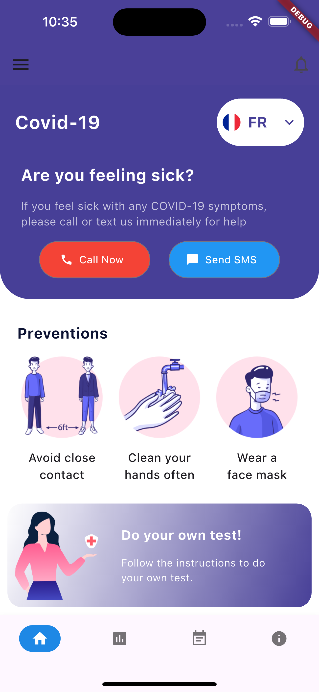
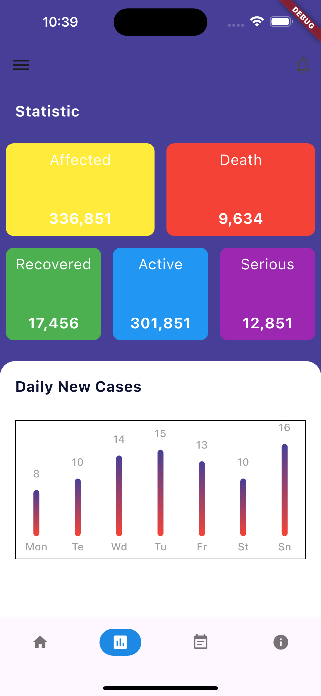

# 🚀 covid_dashboard_ui

## 📖 About the Project
A mobile application designed to help track COVID-19 cases and provide essential support.  
The app allows users to:  
- 📊 Monitor the number of infections and deaths in real time  
- 🆘 Request help or emergency assistance  
- 🧪 Book a COVID-19 test directly through the app  

---

## 📱 Screenshots

  
  

---

## 🛠️ Built With
- [Flutter](https://flutter.dev/) – Cross-platform framework  
- [Dart](https://dart.dev/) – Programming language  

